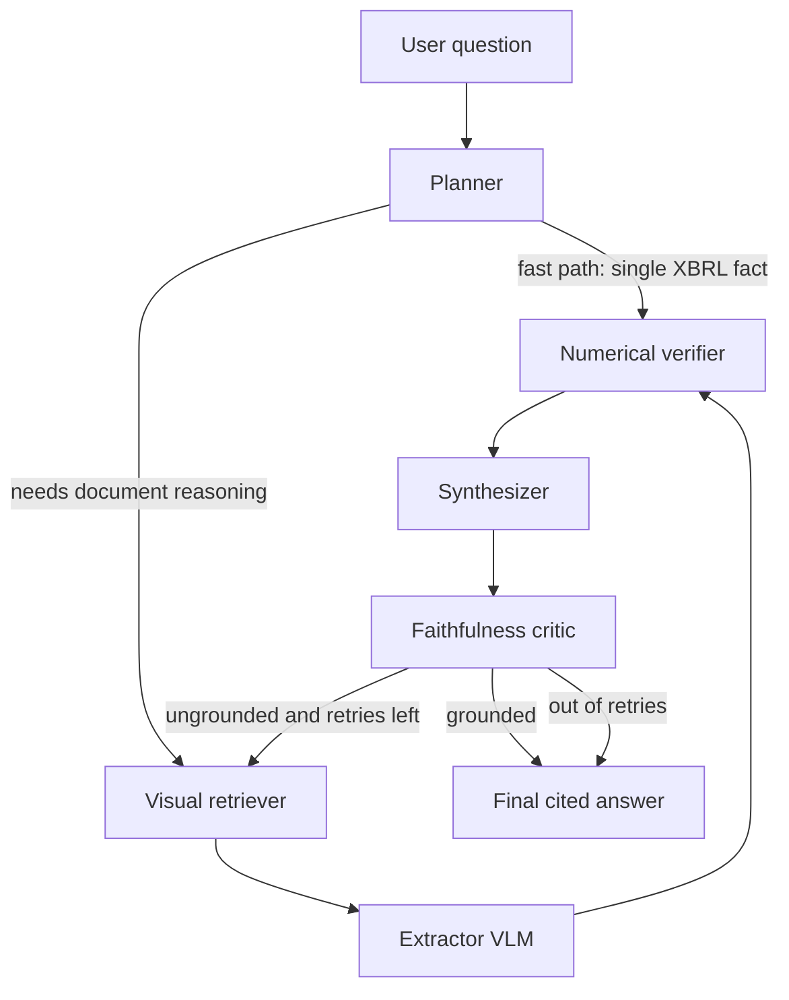

# LedgerLens — implementation design

A multimodal financial-filing intelligence engine. Visual retrieval over SEC filing pages, a multi-agent reasoning graph that verifies every number against XBRL ground truth, and an eval harness that makes the accuracy claims defensible.

This doc covers four things end to end: the repo scaffold and week-1 ingestion, the LangGraph agent graph, the XBRL-grounded eval harness, and the model picks plus the ColPali multi-vector storage decision.

A note on currentness: specific model checkpoints, SEC rate limits, and vector-DB feature support all drift. Treat the named versions here as a starting point and verify the current state on the HuggingFace model hub, the SEC developer docs, and your vector DB's docs when you reach each part.

---

## 0. Guiding principle

Build the boring foundation first. By the end of week 1 you want one thin end-to-end thread — ingest a few filings, a dumb text-only RAG baseline, and an eval that scores it against XBRL — running on a tiny slice of data. The mediocre baseline number is the most valuable artifact of week 1, because the delta between it and your final visual-retrieval number is your headline resume bullet and your whole interview narrative. You cannot tell that story without the baseline.

Scope hard at the start: 2–3 companies, a handful of 10-Ks/10-Qs. Resist ingesting all of EDGAR.

---

## 1. Repo scaffold + week-1 ingestion

### 1.1 Repo layout

```
ledgerlens/
  ingest/
    edgar.py          # polite EDGAR client (User-Agent, rate limit, cache)
    filings.py        # pick filings, download primary doc HTML
    render.py         # HTML -> PDF -> per-page PNG (for visual retrieval)
    xbrl.py           # companyfacts -> normalized facts table (ground truth)
  index/
    text_baseline.py  # chunk + embed text into pgvector (week 1)
    visual.py         # ColPali page embeddings + storage (week 3-4)
    store.py          # pgvector helpers, schema migrations
  agents/
    state.py          # LangGraph state schema
    nodes.py          # planner, retriever, extractor, verifier, synth, critic
    graph.py          # graph wiring + conditional edges
  eval/
    gold.py           # auto-generate Q&A from XBRL + hand-written set
    metrics.py        # exact-match, recall@k, faithfulness, hallucination
    run.py            # eval runner -> JSON + markdown report
    gold_set.jsonl    # versioned, committed to the repo
  api/
    main.py           # FastAPI
  app/                # thin viewer (Streamlit first, Next.js later)
  docker-compose.yml  # postgres + pgvector
  pyproject.toml
```

### 1.2 The EDGAR client — do this right once

SEC blocks requests without a descriptive `User-Agent` carrying contact info, and enforces a rate limit (historically around 10 requests/second). Build one polite, cached client and route every call through it.

```python
# ingest/edgar.py
import time, requests, requests_cache

HEADERS = {"User-Agent": "LedgerLens yourname your@email.com"}
session = requests_cache.CachedSession("edgar_cache", expire_after=86400)

_last = [0.0]
def _throttle(min_interval=0.15):           # ~6-7 req/s, comfortably under the cap
    dt = time.monotonic() - _last[0]
    if dt < min_interval:
        time.sleep(min_interval - dt)
    _last[0] = time.monotonic()

def get(url: str) -> requests.Response:
    _throttle()
    r = session.get(url, headers=HEADERS)
    r.raise_for_status()
    return r
```

Key endpoints (CIK is zero-padded to 10 digits):

- Ticker -> CIK map: `https://www.sec.gov/files/company_tickers.json`
- Submission history (filing list): `https://data.sec.gov/submissions/CIK{cik10}.json`
- All XBRL facts for a company (the ground-truth gold mine): `https://data.sec.gov/api/xbrl/companyfacts/CIK{cik10}.json`
- A single concept's time series: `https://data.sec.gov/api/xbrl/companyconcept/CIK{cik10}/us-gaap/{Concept}.json`
- Filing documents: `https://www.sec.gov/Archives/edgar/data/{cik}/{accession_no_nodashes}/{filename}`
- Full-text search API: `https://efts.sec.gov/LATEST/search-index?q=...`

### 1.3 Picking and downloading filings

From the submissions JSON, `filings.recent` gives parallel arrays of `form`, `accessionNumber`, `primaryDocument`, `filingDate`, `reportDate`. Filter to `form in {"10-K", "10-Q"}`, take the most recent few, and build the document URL from the accession number (strip dashes) and `primaryDocument`.

### 1.4 Page images for visual retrieval

ColPali retrieves over page *images*, so you need a per-page image representation. Filings are HTML, so render HTML -> PDF -> rasterized PNGs:

```python
# ingest/render.py
from playwright.sync_api import sync_playwright   # HTML -> PDF
import fitz                                        # PyMuPDF: PDF -> PNG

def html_to_pdf(html_path, pdf_path):
    with sync_playwright() as p:
        page = p.chromium.launch().new_page()
        page.goto(f"file://{html_path}")
        page.pdf(path=pdf_path, format="A4", print_background=True)

def pdf_to_pngs(pdf_path, out_dir, dpi=150):
    doc = fitz.open(pdf_path)
    paths = []
    for i, page in enumerate(doc):
        pix = page.get_pixmap(dpi=dpi)
        path = f"{out_dir}/page_{i:04d}.png"
        pix.save(path); paths.append(path)
    return paths
```

Store a `page` record per image: `(filing_accn, page_idx, png_path)`. 150 DPI is a good quality/size balance for VLM reading; bump it if small-font footnotes are getting lost.

### 1.5 XBRL ground truth

`companyfacts` returns `facts -> {us-gaap, dei} -> {ConceptName} -> units -> {USD: [...]}`, where each fact has `val`, `start`, `end`, `fy`, `fp` (fiscal period), `form`, `filed`, `accn` (accession). The `accn` lets you join a fact back to the filing it came from. Normalize this into a flat table:

```python
# ingest/xbrl.py
def normalize_facts(companyfacts: dict) -> list[dict]:
    rows = []
    for taxonomy in ("us-gaap", "dei"):
        for concept, body in companyfacts.get("facts", {}).get(taxonomy, {}).items():
            for unit, facts in body.get("units", {}).items():
                for f in facts:
                    rows.append({
                        "concept": concept, "unit": unit, "value": f["val"],
                        "start": f.get("start"), "end": f.get("end"),
                        "fy": f.get("fy"), "fp": f.get("fp"),
                        "form": f.get("form"), "accn": f.get("accn"),
                    })
    return rows
```

This table is used in three places: to auto-generate eval questions, as the reference for the numerical-verification agent, and as the truth your final accuracy number is measured against. Set it up in week 1.

### 1.6 The text-only baseline (the comparison number)

Deliberately naive: extract text, chunk, embed, retrieve, answer. It will mangle tables and get numbers wrong — that is the point, and the demonstration of the failure mode that justifies the whole project.

```python
# index/store.py — schema
# CREATE EXTENSION vector;
# CREATE TABLE chunks (
#   id bigserial PRIMARY KEY, filing_accn text, page_idx int,
#   content text, embedding vector(768)
# );
# CREATE INDEX ON chunks USING hnsw (embedding vector_cosine_ops);
```

Parse the HTML text (BeautifulSoup), chunk by token count with overlap, embed each chunk, insert. Retrieval is cosine top-k; the answer is generated by an LLM over the retrieved chunks. Keep this module simple — you are not trying to make it good, you are trying to make it a baseline.

### 1.7 Week-1 done = the thin thread runs

Ingest -> baseline retrieval -> LLM answer -> eval against XBRL on 15–20 questions, with a number printed. That number is your week-1 deliverable.

---

## 2. The LangGraph agent graph

The graph is the retrieve -> extract -> verify -> synthesize -> critique loop, with a reflection edge that sends an ungrounded answer back to retrieval. A linear chain cannot express that conditional return cleanly; LangGraph can.

### 2.1 Graph shape



The planner fast path matters: a question that is purely a single reported figure ("What was revenue in Q3?") can be answered straight from the XBRL table without ever invoking the expensive VLM. Routing that away is a real cost lever and a good design point to articulate.

### 2.2 State schema

```python
# agents/state.py
from typing import Annotated, TypedDict, Literal
from operator import add

class Fact(TypedDict):
    text: str                 # the claim, e.g. "Q3 revenue was $X"
    value: float | None       # parsed numeric value, normalized units
    concept: str | None       # mapped XBRL concept guess
    page_ref: str             # filing_accn:page_idx the claim came from
    verified: Literal["match", "mismatch", "unverifiable", "pending"]

class State(TypedDict):
    question: str
    plan: list[str]                          # sub-questions / retrieval queries
    route: Literal["fast", "document"]
    pages: Annotated[list[dict], add]        # retrieved candidate pages (accumulates)
    facts: list[Fact]                        # extracted + verification status
    draft: str
    critique: dict | None                    # {"grounded": bool, "reasons": [...]}
    retries: int
    answer: str | None
```

`Annotated[list, add]` makes `pages` a reducer so repeated retrieval across reflection loops accumulates rather than overwrites.

### 2.3 Nodes

- planner — decomposes the question, sets `plan` (retrieval queries) and `route`. For `route == "fast"`, it also records the target XBRL concept + period so the verifier can answer directly.
- visual_retriever — runs the two-stage ColPali retrieval (section 4) over the page-image index, appends top-k pages to `pages`.
- extractor — sends the top pages (images) to the VLM with the sub-questions; returns `Fact` objects with a `page_ref` for each claim. Page-level citation is the floor; region/bbox citation if the VLM supports it.
- numerical_verifier — a guardrail, mostly deterministic. For each `Fact` with a numeric value, fuzzy-match it to an XBRL concept + period and compare with tolerance; set `verified`. Flags mismatches loudly. This is the node that makes "the numbers are always right" true.
- synthesizer — composes the answer from `match`/`unverifiable` facts only, with citations. Never emits a `mismatch` figure.
- critic — faithfulness check: is every claim in `draft` grounded in a retrieved page and not contradicted by verification? Returns `critique`.

### 2.4 Wiring and the reflection edge

```python
# agents/graph.py
from langgraph.graph import StateGraph, END

def route_after_planner(s): return "verifier" if s["route"] == "fast" else "retriever"

def route_after_critic(s):
    if s["critique"]["grounded"]:           return END
    if s["retries"] >= 2:                   return END   # give up gracefully, flag low confidence
    return "retriever"

g = StateGraph(State)
g.add_node("planner", planner)
g.add_node("retriever", visual_retriever)
g.add_node("extractor", extractor)
g.add_node("verifier", numerical_verifier)
g.add_node("synth", synthesizer)
g.add_node("critic", critic)

g.set_entry_point("planner")
g.add_conditional_edges("planner", route_after_planner,
                        {"verifier": "verifier", "retriever": "retriever"})
g.add_edge("retriever", "extractor")
g.add_edge("extractor", "verifier")
g.add_edge("verifier", "synth")
g.add_edge("synth", "critic")
g.add_conditional_edges("critic", route_after_critic,
                        {"retriever": "retriever", END: END})

app = g.compile()   # add a checkpointer if you want resumable runs
```

The retry counter increments in the critic (or a tiny node before the loop) so the graph can't spin forever — it degrades to a flagged-low-confidence answer instead. That bounded reflection loop is the single most senior-engineering thing in the design.

---

## 3. XBRL-grounded eval harness

This is where you win. Three failure surfaces, measured separately, gated in CI.

### 3.1 Two-part gold set

Auto-generated numeric set (large, free): from the normalized XBRL table, template questions whose answer is a known fact.

```python
# eval/gold.py
def auto_questions(facts, company):
    for f in facts:
        if f["fp"] and f["value"] is not None:
            yield {
                "q": f'What was {company}\u2019s {humanize(f["concept"])} for {f["fp"]} {f["fy"]}?',
                "answer_value": f["value"], "unit": f["unit"],
                "concept": f["concept"], "accn": f["accn"], "kind": "numeric",
            }
```

Hand-written reasoning set (small, curated): multi-step questions where the value isn't a single fact — margins, QoQ trends, "what did management attribute the change to". Store an expected numeric answer where one exists, plus a short rubric for the prose part. Commit `gold_set.jsonl` and version it; the eval gate compares against a fixed version.

### 3.2 Metrics

- Numerical exact-match — the headline. Normalize units and scale (thousands vs millions vs raw), then compare with a small relative tolerance for rounding. `match if abs(pred - truth) <= tol * abs(truth)`.
- Retrieval recall@k — was a page containing the ground-truth fact in the retrieved set? Build approximate page-truth by locating the value string in the rendered text per page.
- Citation faithfulness — every claim traces to a cited page that actually supports it (LLM-judge + a check that the cited page text/region contains the value).
- Hallucinated-figure rate — numbers in the answer with no XBRL support and no page support. Target this toward zero; it's your trust metric.
- Reasoning correctness — on the hand-written set, exact-match where numeric, LLM-as-judge against the rubric otherwise.
- Cost and p95 latency per query, logged per config so you can show the cost-control wins.

### 3.3 Runner and report

`eval/run.py` loads the gold set, runs the graph per question, scores each metric, and writes both a machine-readable `results.json` and a human-readable markdown summary (per-metric aggregates plus the worst failures, which are gold for debugging). Run the same suite against the text baseline and against the visual pipeline so every report shows the delta.

### 3.4 CI gate

A GitHub Action runs the suite on a fixed gold subset on every PR and fails the build if numerical exact-match drops below threshold or hallucination rate rises above threshold. This is the behavior that reads as production maturity: a prompt or model change that quietly degrades faithfulness cannot merge.

```yaml
# .github/workflows/eval.yml (sketch)
- run: python -m eval.run --subset ci --report results.json
- run: python -m eval.gate results.json --min-numeric-em 0.85 --max-hallucination 0.02
```

On LLM-as-judge: calibrate the judge against a handful of human labels before trusting it, use a strong judge model, and keep the deterministic XBRL exact-match as the metric you actually gate on — the judge is for the fuzzy reasoning metrics, not the numbers.

---

## 4. Model picks + ColPali storage

### 4.1 The model roster

- Visual retriever: a ColPali / ColQwen-family late-interaction model. It embeds each page image into a multi-vector representation (one vector per image patch token) and the text query into per-token vectors; scoring is MaxSim (ColBERT-style late interaction). Check the HF hub for the current best checkpoint and its embedding dimension and patch count.
- Extraction VLM: an open vision-language model (Qwen2-VL class, 2B for speed or 7B for quality) reads the retrieved page images and extracts figures/tables/text. This is the component that reads tables and charts correctly instead of mangling them. A frontier multimodal API is a drop-in if budget allows.
- Planner / critic LLM: a smaller, cheaper general model — these tasks are routing and classification, not deep reasoning.
- Synthesizer LLM: a stronger general model, invoked once per answer.
- Text embeddings: a standard sentence-embedding model for the baseline and for the stage-1 page filter below.
- (Whisper large-v3 for earnings-call audio — the stretch module.)

Route deliberately: cheap models for planner/critic, the expensive VLM only on the top few pages after reranking.

### 4.2 The ColPali storage problem (the interesting part)

ColPali produces roughly a thousand vectors per page — one per image patch token — and scoring is MaxSim: for each query token, take its max similarity to any page patch, then sum across query tokens. Standard single-vector ANN (pgvector cosine) does not directly implement late interaction, so you have a real design decision.

Recommended two-stage approach, which keeps you in pgvector and controls cost:

1. Stage 1 — cheap candidate filter. Store one mean-pooled page vector per page in pgvector with an HNSW index. Retrieve the top ~50 candidate pages by cosine. This is fast and approximate.
2. Stage 2 — MaxSim rerank. Load the full multi-vector patch embeddings for only those ~50 candidates (cached on disk as parquet/npy keyed by `filing_accn:page_idx`), compute MaxSim against the query's token vectors, and take the top-k. Send only those top-k to the extraction VLM.

```python
# index/visual.py (rerank sketch)
import numpy as np
def maxsim(query_vecs, page_vecs):           # (Tq, d), (Tp, d)
    sim = query_vecs @ page_vecs.T           # (Tq, Tp)
    return sim.max(axis=1).sum()             # late interaction score
# candidates = pgvector_topn(meanpool(query), n=50)
# scores = {p: maxsim(q_vecs, load_patch_vecs(p)) for p in candidates}
# topk = sorted(scores, key=scores.get, reverse=True)[:5]
```

Why this is the right solo-engineer call: full brute-force MaxSim over the whole corpus is fine at hundreds of pages but doesn't scale; native multi-vector / late-interaction indexes exist in some vector engines but add operational complexity you don't need at portfolio scale. The two-stage filter-then-rerank pattern is the pragmatic middle, and being able to explain that tradeoff — and the storage cost of multi-vector embeddings (vectors-per-page x pages x dim x bytes adds up fast, so cache and consider quantizing) — is exactly the kind of depth that separates an AI engineer from an API wrapper in an interview.

### 4.3 Cost controls to bake in from the start

- The planner fast path skips retrieval and the VLM entirely for single-fact lookups.
- Stage-1 filtering means the VLM only ever sees the top-k reranked pages, not whole filings.
- Cache aggressively: page renders, page embeddings, transcripts. Re-indexing should be incremental.
- Semantic cache on repeated questions.
- Log cost and latency per node so the wins are measurable and reportable.

---

## Sequencing recap

- Weeks 1–2: ingestion + XBRL ground truth + text baseline + first eval (the comparison number).
- Weeks 3–4: ColPali two-stage retrieval + VLM extraction; re-run the eval and capture the delta.
- Weeks 5–6: the LangGraph graph — verifier, synthesizer, critic, the bounded reflection loop.
- Weeks 7–8: the full three-tier eval harness wired into CI; tracing/observability.
- Weeks 9–10: earnings-call ASR and/or forecasting module, plus the cited-region viewer.

Useful by week 4, portfolio-grade by week 10.
